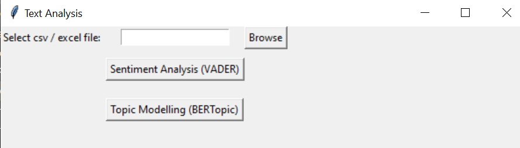

# YouTube Comments Analysis Tool

This analytical tool is designed for analyzing comments on YouTube videos using **VADER sentiment analysis** and **BERTopic** for topic modeling.



You can download YouTube comments as `.xlsx` or `.csv` files using the [YouTube Comment Extractor](https://github.com/HenryKong112/HenryKong112-YouTube-Comment-Extractor).

**Watch the demonstration video for YouTube Comment Extractor:** https://www.youtube.com/watch?v=ZpG8ppoPqEI

Additionally, you can merge multiple Excel or CSV files into one using the [EXCEL-CSV-MERGER](https://github.com/HenryKong112/EXCEL-CSV-MERGER).

**Watch the demonstration video for Excel/CSV Merger:** https://www.youtube.com/watch?v=ZpG8ppoPqEI

## 🎞️YouTube Comments Analyzer's Demonstration: 
https://www.youtube.com/watch?v=yt_6PPcy9OI 

---

## Table of Contents
- [Documentation](#documentation)
  - [1. UMAP](#1-umap)
  - [2. Sentence-transformer](#2-sentence-transformer)
- [Limitation](#limitation)
- [Instruction](#instruction)
  - [1. Select the .xlsx / .csv file containing the comments](#1-select-the-xlsx--csv-file-containing-the-comments)
  - [2. Sentiment Analysis (VADER)](#2-click-sentiment-analysis-vader)
  - [3. Topic Modelling (BERTopic)](#3-click-topic-modelling-bertopic)

---

## Documentation

### 1. UMAP
Learn more about UMAP parameters at the official [UMAP Documentation](https://umap-learn.readthedocs.io/en/latest/parameters.html).

### 2. Sentence-transformer
Pre-trained models used for semantic search: [Sentence Transformer Models](https://sbert.net/docs/sentence_transformer/pretrained_models.html#semantic-search-models).

---

## Limitation
- **VADER** struggles with recognizing negation, idioms, and sarcasm.
- **BERTopic** button might not generate graphs if there aren't enough comments.
- Analysis is limited to **English comments** only.

---

## Instruction

### 1. Download the files and run 
```
$ python gui.py
```
A Graphical User Interface (GUI) will show up.

### 2. Select the .xlsx / .csv file containing the comments 

- Click `Browse` to choose the file.
- OR enter the file path directly in the entry box.

Ensure that the file contains the following columns:

| Column Name  | Data Type  | Description                                                    |
|--------------|------------|----------------------------------------------------------------|
| `PublishedAt`| DATETIME   | The date and time when the comment was originally published.    |
| `Like`       | INTEGER    | The total number of likes the comment has received.             |
| `Comment`    | TEXT       | The text content of the comment.                               |

---

### 3. Click Sentiment Analysis (VADER)

This option provides:
- Three **graphs**.
- A **VADER summary table**.
- A new **Excel/CSV file** with sentiment classification for each comment.

#### Graphs:
1. **Sentiment Distribution**: Count vs. Likes
2. **Engagement (Likes per Count) by Sentiment**
3. **Sentiment Trend Over Time**

#### VADER Summary Table Schema:
| Column Name     | Data Type | Description                                                   |
|-----------------|-----------|---------------------------------------------------------------|
| `Sentiment`     | String    | Sentiment category: `Positive`, `Negative`, or `Neutral`.      |
| `Count`         | Integer   | The total number of occurrences for each sentiment.            |
| `Likes`         | Integer   | The total number of likes for each sentiment.                 |
| `Count_Percent` | Float     | Percentage share of each sentiment's occurrence.               |
| `Likes_Percent` | Float     | Percentage of total likes received by each sentiment.          |
| `Engagement`    | Float     | Number of likes per count.                                     |

---

### 4. Click Topic Modelling (BERTopic)

The pre-trained model used is `all-MiniLM-L6-v2`, which offers a balance between speed and quality. This option will generate two **graphs** in your browser.

#### Graphs:
1. **Topic Word Scores**:
   - Ranked list of the most relevant words for each topic.
   - Words with the highest scores represent each topic.
   - Helps interpret the themes based on dominant words.

2. **Intertopic Distance Map**:
   - A 2D plot showing how distinct or related different topics are.
   - Topics close together share similarities; those further apart are more distinct.
   - Circle size represents topic prevalence within the dataset.

---

Enjoy using the YouTube Comments Analysis Tool!
